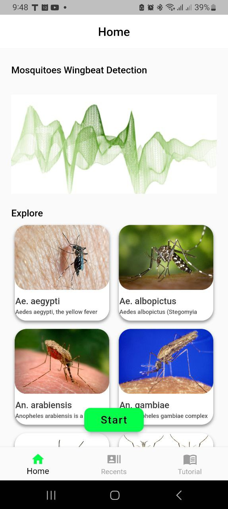
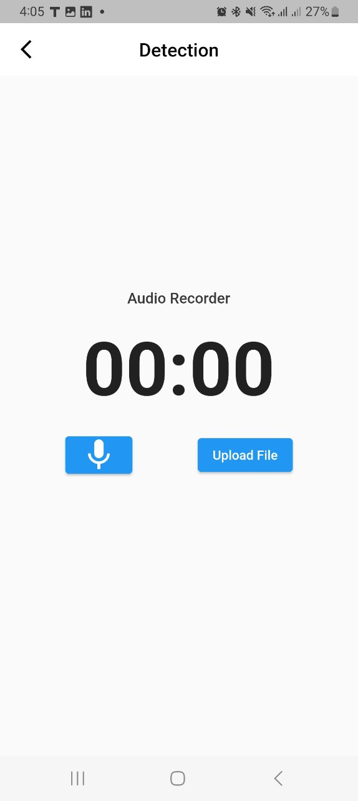
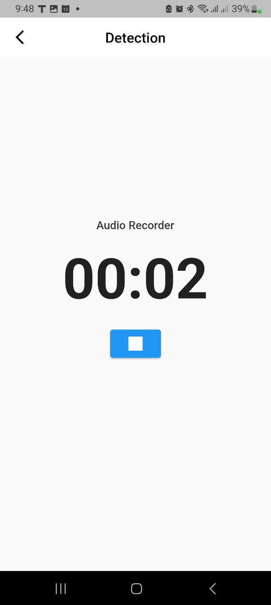
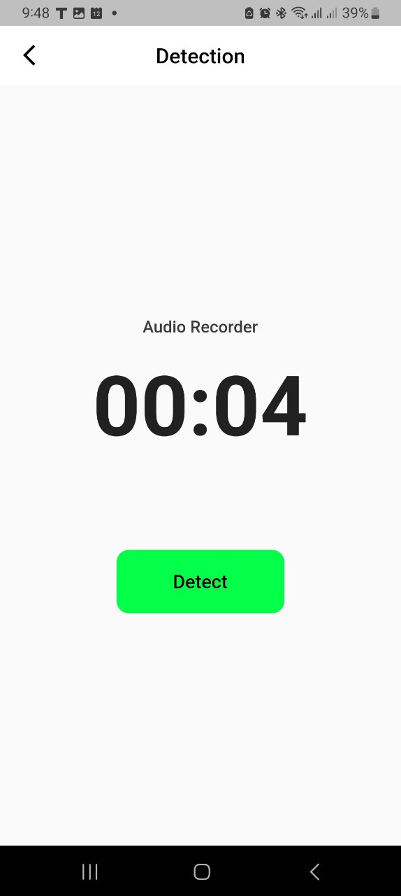
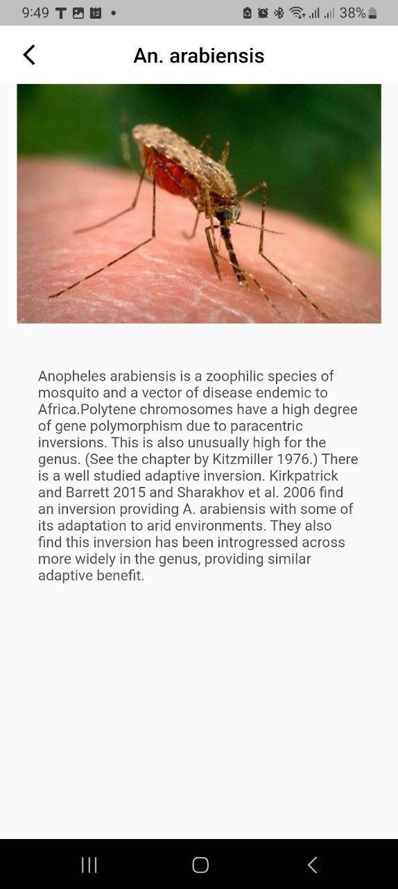

# Mosquito Species Classification

Welcome to the Mosquito Species Classification project! This project aims to classify mosquito species based on their wingbeat sounds using machine learning techniques. It includes a mobile app for real-time mosquito detection and a machine learning notebook for model training and evaluation.

## Features

- Mobile App: The mobile app allows users to record and classify mosquito species in real-time using their smartphone's microphone. It provides a user-friendly interface and delivers fast and accurate results.

- Machine Learning Notebook: The notebook provides a detailed guide on how to use the pre-trained mosquito species classification model. It includes information on data preprocessing, feature extraction, and model evaluation.

- Flask Backend: The Flask backend serves as an API endpoint for the mobile app. It handles audio file uploads, preprocesses the audio data, and uses the pre-trained model to make predictions on the mosquito species.

## Project Structure

The project is structured as follows:

- `mobile_app/`: Contains the source code for the mobile app.
- `machine_learning_notebook/`: Contains the Jupyter notebook for using the pre-trained model.
- `flask_backend/`: Contains the Flask backend code.

## Usage

To use the project, follow these steps:

1. Set up the Flutter mobile app.
2. Deploy the Flask backend by running the `app.py` script in the `Backend/` directory.
3. Connect the mobile app to the deployed Flask backend.
4. Start classifying mosquito species using the mobile app's recording feature.

## Dataset

The mosquito species classification model has been trained on the "Mosquito Wingbeat Sounds" dataset. This dataset contains audio recordings of various mosquito species, annotated with their corresponding labels. You can obtain the dataset from [https://www.kaggle.com/datasets/potamitis/wingbeats]. Please refer to the dataset documentation for more information on its usage and licensing.

## License

This project is licensed under the [MIT License](LICENSE). Feel free to use and modify the code according to your needs.

## Contributions

Contributions to the project are welcome! If you have any suggestions, bug fixes, or additional features to add, please submit a pull request.

## Screenshots
 

If you have any questions or need further assistance, please feel free to reach out to me.

Happy mosquito species classification!
